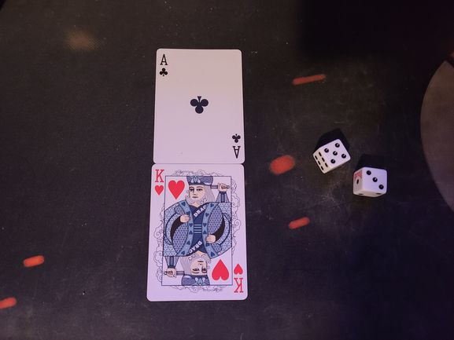
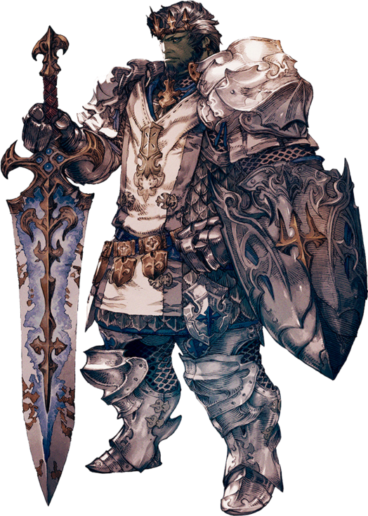
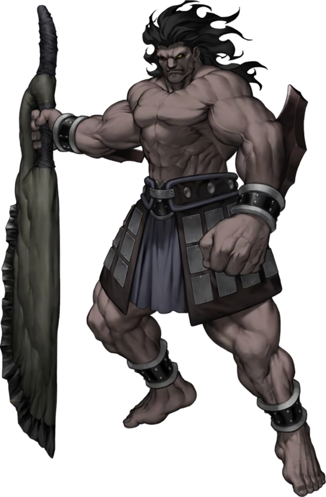
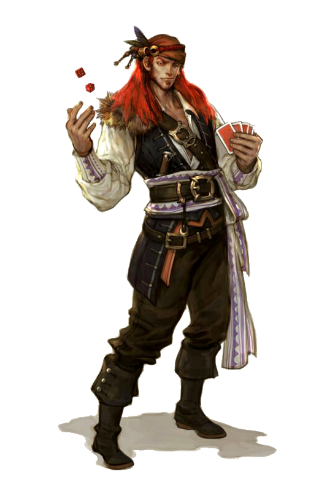

# Bludgeons and Braggings
All that is needed is a deck of cards, two dice, a piece of paper, and of course players.
Players will battle each other with cards of different stats and abilities. There are four classes to choose from: Warrior (Spades),
Berserker (Clubs), Gambler (Diamonds) and Paladin (Hearts). Two players compete in a series of 1v1 battles and only one player will remain victorious.

## Background
This game is inspired by various RPGs such as D&D and Fire Emblem with its different classes and combat.

## Rules
Two players take turns drawing a card from the deck, totaling to 5 cards per player. Then, players roll a die to determine
who goes first. The highest number rolled wins, but if there is a tie, then reroll until there is a winner.
The player who gets the highest number gets to decide if they want to go first or let their opponent go first.
The person who goes first has the advantage of attacking first, but the person going second has the advantage of picking a card
to counter their opponent. Player 1 chooses an action, then Player 2 chooses an action. The results are calculated after both players have
chosen their actions. Afterwards, the Players alternate who chooses an action first until the battle is done.
The battle is done once a player's card's health reaches 0.
The game is decided by a best of 5 match. However, if a quicker game is needed, then it can be a best of 3 match with 3 cards per player.

Picture of a typical battle. In this case, a Paladin vs an enemy Berserker

### Actions
Four types of actions: Attack, Defend, Dodge, Ability
  * Attack: Does damage to the opponent based on their opponent's defense
		Damage calculations: Attack is subtracted by the defense of the opponents. If the the attack is equal or lower than the opponents defense
		then the base damage is 0. Two dice are rolled to determined for additional damage.

  * Defend: Halves the damage taken, if the damage ends in a decimal, then round up or down to the nearest whole number.

  * Dodge: Chance to complete avoid damage by rolling a single die, dependent on the speed stat. For every increment of 10 in the speed stat, the chances of dodging is more successful.
		Ex: Speed stat of 10 must roll a 6 to dodge, a speed stat of 20 must roll 6 or 5 to dodge, a speed stat of 40 must roll between 6-3 to dodge. 0 speed cannot dodge.

  * Ability: Every class has their own unique ability that can change the tide of battle, but that ability can only be used once per battle.
		 More details in the Class Descriptions
### Class Descriptions
Four type of stats: Health, Attack, Defense, Speed

Total Stats: 130

	
#### \[Warrior\] Health: 50, Attack: 30, Defense: 20, Speed: 30
	  Ability: [Dual Strike] Attacks twice in one turn. For the second attack, the opponent suffers a -10 penalty to their defense for that turn only. If opponent uses defend or dodge, only the first attack is affected.

	
#### \[Paladin\] Health: 60, Attack: 30, Defense: 30, Speed: 10
	  Ability: [War Prayer] Heal for 15 Health and an additional action is taken. Cannot heal above max health.

	
#### \[Berserker\] Health: 80, Attack: 40, Defense: 0, Speed: 10
	  Ability: [Bloodlust] Survive a fatal attack and perform a counter-attack at half damage.
		   
#### \[Gambler\] Health: 45, Attack 30, Defense: 15, Speed: 40
	  Ability: [All-in] Ignore opponent's defend or dodge action. Perform a normal attack action and afterwards, roll two dice again. If the total is less than 7, deal 15 damage.
		   If the total is 7 or greater, deal 30 damage.

## Strategies
The Warrior is a jack-of-all-trades class and can perform reasonably well in most situations.
The remaining three classes are more specialized, with the Paladin being able to tank damage, the Berserker to deal massive damage, and the Gambler to have
the potential to deal big damage and dodge attacks.
